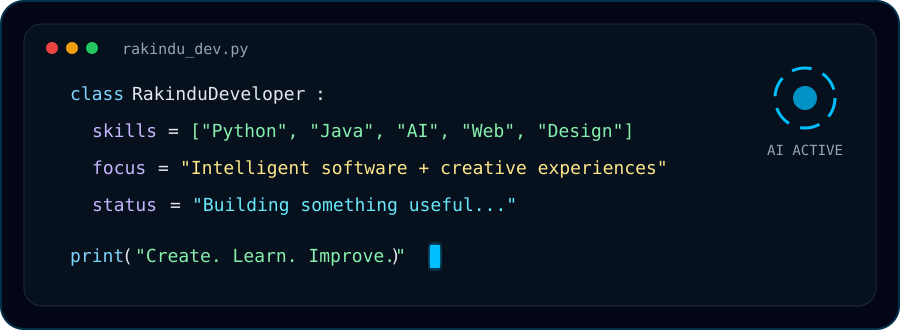
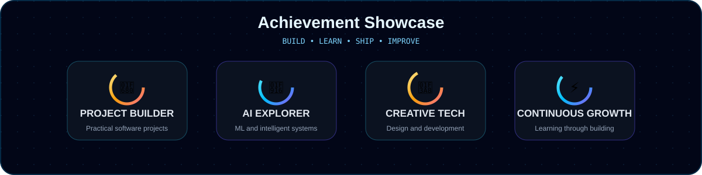

 

 

## 👨‍💻 About Me

  

 

- 🎓 BSc (Hons) Software Engineering undergraduate
- 🤖 Interested in Artificial Intelligence, Machine Learning and intelligent web systems
- 💻 Building projects with Python, Flask, Java, JavaScript, HTML, CSS and MySQL
- 📊 Interested in data analytics, predictive modelling and practical ML applications
- 🎨 Creative designer working with Figma and Adobe creative tools
- 🚀 Currently developing AI-driven software projects including HelaFixIt AI
- 📍 Based in Sri Lanka
- 📫 Reach me at **rakindufernando@gmail.com**
- 🌐 Portfolio **rakindufernando.lk**

## 🛠️ Tech Stack

## 🚀 Featured Projects

<table>
<tr>
<td width="50%" valign="top">

### 🧠 Student Health Risk Prediction

Machine learning system for multiclass student health-risk prediction using a complete preprocessing and XGBoost workflow.

**Tech** Python · Flask · XGBoost · scikit-learn · Pandas

[View Repository](https://github.com/rakindufernando/student-health-risk-project)

</td>
<td width="50%" valign="top">

### 🧾 Invoice Generator

A practical web-based invoice generation application designed for simple business use.

**Tech** Web Development · JavaScript · HTML · CSS

[View Repository](https://github.com/rakindufernando/Invoice-Generator)

</td>
</tr>
<tr>
<td width="50%" valign="top">

### 🌊 Ocean View Resort

Web project developed around a resort-management and customer-facing experience.

**Tech** Web Development · UI · Backend Integration

[View Repository](https://github.com/rakindufernando/oceanviewresort)

</td>
<td width="50%" valign="top">

### 🌐 Portfolio Website

Personal portfolio showcasing software engineering, creative design and development work.

**Website** [rakindufernando.lk](https://rakindufernando.lk)

[View Repository](https://github.com/rakindufernando/rakindufernandoupdatedwebpage)

</td>
</tr>
</table>

## 📊 GitHub Activity

 

## 🏆 Achievement Showcase

## 🐍 Contribution Snake

## 🤝 Connect With Me

  

